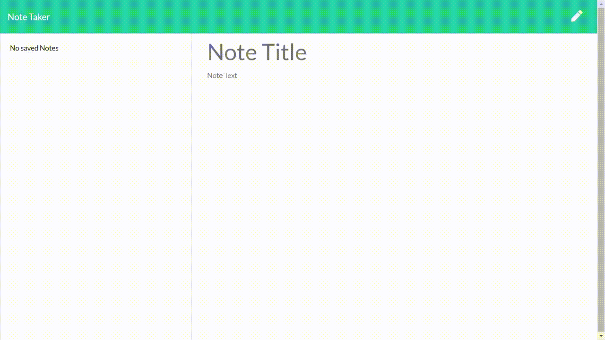

# Note_Taker

## Objective:
Create an application that can be used to write, save, and delete notes. This application will use an express backend and save and retrieve note data from a JSON file.

## User Story:
AS A user, 
I WANT to be able to write and save notes, view previously written notes and delete notes I no longer need 
SO THAT I can organize my thoughts and keep track of tasks I need to complete

## Business Context:
For users that need to keep track of a lot of information, it's easy to forget or be unable to recall something important. Being able to take persistent notes allows users to have written information available when needed.

## Link to the App hosted by Heroku
https://express-note-taker-app22.herokuapp.com/

